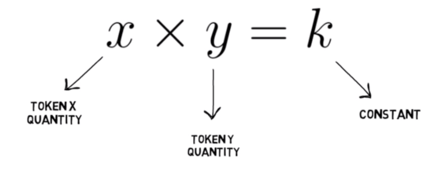

# Automatic Locked Liquidity

The ability to collect and retain liquidity is one of the biggest challenges for any DeFi asset or platform. In a vast majority of DeFi systems, users must provide liquidity by creating or adding to token pairs in liquidity pools. A commonly misunderstood trait of these systems is something called "impermanent loss" which can be explained as a temporary decrease in balance of one-side of the provided LP pair for the liquidity provider in an attempt to maintain a constant product (as described in the "constant product model" x \* y = k). For the average or new user this entire process can seem murky and lead to a perceived loss of value, and as such, may deter some users from interacting with the protocol.

In conclusion, DeFi projects using liquidity pools require multiple steps by the holders and are often confusing for newcomers and tend to lead to erroneous decisions.

ONEMOON solves this problem by avoiding farming all together, as well as automatically locking a percentage of transaction fees into "locked liquidity" of ONE/ONEMOON LP. This leads to a far safer and trustable econmic base as stakeholders can count on available liquidity being present as the liquidity can indeed not be removed, but must be accessed only through swaps.
