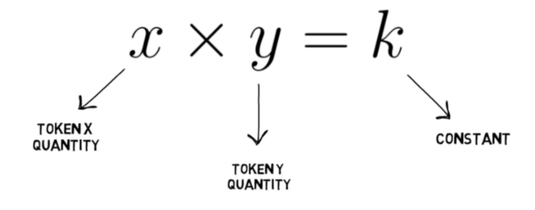

# Introduction

ONEMOON is the first deflationary, passive yield generation token on the Harmony ONE network. At inception, the core premise of ONEMOON was create a frictionless static yield generation asset that offers stakeholders a new type of passive rewards which does not require the asset to be staked, or used to provide liquidity. To partake in DeFi yields all you have to do is hold ONEMOON.

There is an abundance of new users entering blockchain and DeFi. The popular yield generation methods, such as farming, providing liquidity or various other staking methods, are complex topics and can feel cumbersome to new users. This friction can slow down mass adoption of decentralized financial systems, which are meant to empower all types of users, all around the world, not just the most technically proficient in leading economies. There is nothing more convenient or simple than passively holding a DeFi asset and receiving rewards that just "appear" in your wallet.

ONEMOON is an experimental DeFi asset which uses an novel mix of deflation and passive rewards in an attempt to ease this adoption curve. Alongside with this primary goal, ONEMOON incorporates many other battle-tested traits of popular defi assets, not the least of which is the programmatic creation of Locked Liquidity. This, along with an aggressive and consistent supply burn, creates the effect of a "rising price floor" as the volume of ONE/ONEMOON locked liquidity increases.

By simply holding ONEMOON, users are able to gain exposure to the high growth DeFi sector without all the bottlenecks that are typically encountered with various other permissionless DeFi offerings.

## Burning Mechanisms

ONEMOON incorporates a powerful DUAL burn system which also connects it to its parent ecosystem Mochiswap and the governance token therein $hMOCHI. This is a unique multicoin system that benefits the greater ecosystem which in turn benefits ONEMOON both economically and fundamentally as it is part of a larger system. When the configured threshold is reached, the burn process is initiated and will result in the following effects.

* 1.25% of tx fee value of ONEMOON is burned, lowering the max supply and increasing scarcity.
* 1.25% of tx fee value of hMOCHI is burned, lowering the max supply and increasing scarcity of the governance token in the supporting ecosystem of ONEMOON. This results in a very unique type of positive feedback loop that supports the economics of both tokens.

## Automatic Locked Liquidity

The ability to collect and retain liquidity is one of the biggest challenges for any DeFi asset or platform. In a vast majority of DeFi systems, users must provide liquidity by creating or adding to token pairs in liquidity pools. A commonly misunderstood trait of these systems is something called "impermanent loss" which can be explained as a temporary decrease in balance of one-side of the provided LP pair for the liquidity provider in an attempt to maintain a constant product (as described in the "constant product model" x \* y = k). For the average or new user this entire process can seem murky and lead to a perceived loss of value, and as such, may deter some users from interacting with the protocol.

ONEMOON solves this problem by avoiding farming all together, as well as automatically locking a percentage of transaction fees into "locked liquidity" of ONE/ONEMOON LP. This leads to a far safer and trustable econmic base as stakeholders can count on available liquidity being present as the liquidity can indeed not be removed, but must be accessed only through swaps.
