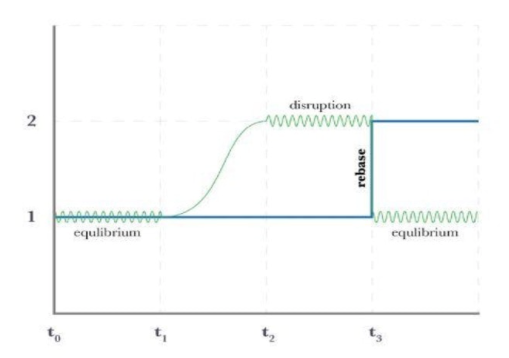

# Tokenomics

ONEMOON incorporates the following fee and burn schedule:

* 5% of TX fees go to existing holders of ONEMOON as rewards.
* 1.5% of TX fees are used to create permanently locked liquidity between ONEMOON-ONE
* 1.5% is delegated to the ONEMOON DAO fund.
* 2% is used to permanently burn ONEMOON.

ONEMOON employs a mechanism called a "reflection" that distributes rewards to stakeholders in realtime, and with zero fees. This is achieved by effectively "rebasing" on every transaction and computing balances in realtime while viewing or entering into state-changing functions. This unique functionality allows ONEMOON to have frictionless utility and generate passive yields for its stakeholders.

Every time a ONEMOON transaction occurs, the protocol checks to see if the latest TX should cause a distribution event. If the fee repository is at or above the accrual threshold, a distribution event occurs, producing a positive yield for stakeholders as well as funding the burn wallet which is then liquidated as described above.

In short, to earn rewards, you simply need to hold ONEMOON in a wallet such as Meta Mask.
